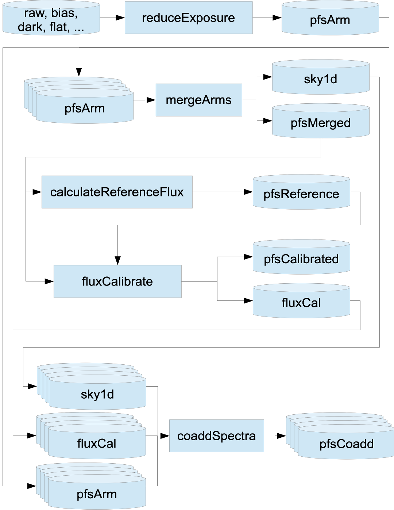

# PFS 2D Pipeline Overview

The latest PFS 2D data reduction pipeline (DRP) is now based on the third generation (Gen3) LSST middleware. The PFS pipeline organizes data using key terms: 

- `visit` refers to a unique exposure identifier.

- `spectrograph` defines the spectrograph module with an integer ranging from `1`–`4`.

- `arm` defines spectrograph's blue, red, near-IR, and medium-resolution red arms (`b`, `r`, `n`, `m`).

- `catId` specifies the catalog source of an object.

- `objId` is a unique (within a catalog) 64-bit identifier for an astronomical source. 

- `pfsDesignId` encodes the fiber configuration.

- `pfsVisitHash` uniquely defines a set of combined visits.

More details can be found in [Appendix](05_01_app_datamodel.md).

## PFS 2D DRP Workflow

---

The PFS 2D DRP generally follows the following flowchart.

>> 

!!! Products
    - `pfsArm`: These are wavelength-calibrated but not combined or flux-calibrated single spectra from a single visit and a single arm.
    - `pfsMerged`: These are arm-combined spectra from a single visit, wavelength calibrated but not flux calibrated.
    - `pfsCalibrated`: These are flux-calibrated arm-merged spectra from a single visit.
    - `pfsCoadd`: These are coadded spectra, and the final products for science.

<!-- ## Gen3 PFS 2D DRP

---

The latest PFS 2D data DRP is now based on the third generation (Gen3) LSST middleware.
The transition from the second generation (Gen2) to Gen3 is a project to migrate the 2D data reduction pipeline’s use of the LSST middleware from Gen2 to Gen3.

The LSST middleware is the middle layer between the data and the algorithms responsible for processing the data. It
provides a “data butler” that provides interfaces for reading and writing the data, a “registry” that keeps track of the
data products, and a framework for running algorithms on the data.

The second generation of the LSST middleware (“Gen2”) had two important shortcomings: it did not keep track of
what data products were available, and it did not provide a simple way to parallelize the processing of data. The third
generation of the LSST middleware (“Gen3”) is a complete rewrite that addresses these shortcomings.

The LSST software distributions no longer support the Gen2 middleware, and so access to bug fixes and new features
requires transitioning the PFS 2D DRP to Gen3. This guide attempts to explain the new features of Gen3 and how we
will use them in the PFS 2D DRP, using the [integration test](https://github.com/Subaru-PFS/pfs_pipe2d/blob/gen3/bin/pfs_integration_test.sh) as a tutorial.

## Acknowledgements

---

The PFS 2D DRP Gen3 transition has been a big project that has taken a lot of time and effort, which has been primarily made by Paul Price. 
We are grateful to the LSST pipeline development team for their help in understanding the Gen3 middleware, and how to overcome the peculiar challenges of applying it to the PFS 2D DRP. 
The products should especially ackknowledge the efforts by Jim Bosch, Nate Lust, Tim Jenness and KT Lim, and to Lee Kelvin for
his helpful writeup on using Gen3 for the [MERIAN project](https://hackmd.io/@lsk/merian).
Significant contributions have also been made by Robert Lupton, Kiyoto Yabe, and Masayuki Tanaka. 

!!! note
    This tutorial is based on the documents, *PFS 2D-DRP Gen3 Transition* (by Paul Price) delivered on September 20, 2024 and the *PFS EDR2 Document* delivered on March 4, 2023. The process introduced in this tutorial mostly follows an [earlier tutorial](https://github.com/yirene/pipe2d_tutorial/blob/main/pipe2d_tutorial.md) for Gen2 pipeline, but some tweaks are included, especially considering that we have started the transition to Gen3 from October 2024. The installation, data reduction, and product retrieval implemented on Gen3 are demonstrated by Zhuoming Li and Yongming Liang. 
    
!!! warning
    The configurations implemented in this tutorial may still be revised in the future for better compatibility. 

<!-- !!! note Large-Scale Cluster
    The latest pipeline is expected to be installed on Large-Scale Cluster (LSC) at NAOJ, and the users can directly utilize the ready environment, with only minor preparations to set up local `drp_pfs_data` (from cloning it from PFS GitHub). -->