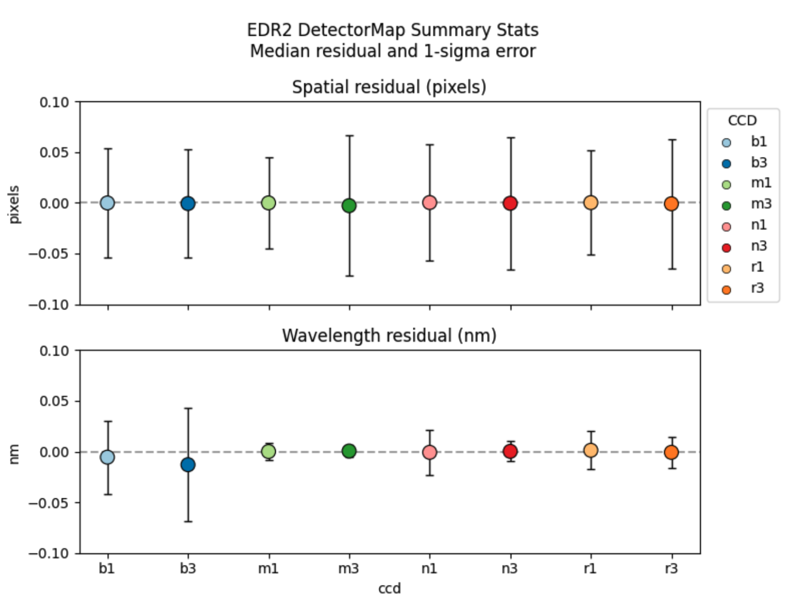

# Quality Assurance (QA)

Finally, we present some examples of the current quality assurance (QA) for checking the data reduction quality, including the QA for detector maps, flux calibration, and fiber normalization, from the PFS Engineering Data Release 2 (EDR2).
Note that because PFS EDR2 is released internally, the figures will not contain specific data information and are only used to demonstrate the QA process.

!!! note
    The QA is still under development, so these figures are not final.

## QA for Detector Map (detectorMapQA)

---

The `detectorMapQA` evaluates how well we identify and locate the fiber traces. We have a ‘default’ `detectorMap` based on calibration data, but each exposure may have slightly offset fiber traces and we adjust the `detectorMap` in an early phase of the pipeline processing. The adjustment is done against the detected positions of continuum/line emission and we reserve a small subset of them from the adjustment. We use these reserved lines to evaluate the `detectorMap` accuracy. 

The example figure below shows offsets in the x- (or spatial) direction across a detector using a sky exposure. This corresponds to r1.
The central panel shows the spatial offset on the detector plane with the amount of offset color-coded. The top and right panels respectively show the offset as a function of fiber and wavelength. In these two subpanels, the points are sorted into used (orange) and reserved (blue) lines. The used lines are used to adjust the `detectorMap`, while the reserved are not. Thus, the reserved lines give a fair estimate of the accuracy. In the central panel, only the reserved lines are plotted. The plot shows a good calibration; there is no region of systematic positive/negative points in the central panel. The numbers in the top-right corner give the median and scatter of the observed residual. 

This figure is similar to the x-offset plot but represents the wavelength (y-) offset. The meanings of the symbols are the same. Note that no rejection has been applied to the RESERVED lines and outliers are included in the plot (e.g., the cyan line; we do apply the rejection when we adjust the `detectorMap`).

This figure below is a summary figure for all the arms. The figure shows the distribution of the median residual for each arm, along with the standard deviation estimated from the interquartile range. We expect the median residual to be close to zero and it is the case for all arms. The scatter is less than  5% of the pixel along the spatial direction. It is similar along the wavelength direction, although b1 and b3 show a somewhat large scatter.

## QA for Spectrum Extraction (extractionQA)

---

From the extracted 1D spectra, fiber profiles, and `detectorMap`, we can reconstruct a 2D image. 
The `extractionQA` primarily evaluates the residual image between a real 2D image (before 1D extraction) and a reconstructed 2D image based on the extracted spectra. If the extraction was perfect, the noise-normalized residual image would show Gaussian noise with mean=0 and sigma=1. Any deviation from the normal distribution with N(0,1) is an indication of poor extraction (and hence this test serves as a QA). 

This figure is from a quartz exposure.
From left to right, each panel shows a real 2D image (`calExp`) around a particular fiber, the residual from the corresponding reconstructed 2D image in units of electrons/sec/nm, the residual in terms of chi, the average chi residual for each row around the fiber (using 7 pixels around the spatial center), and the differences in center positions (dX) and widths (dσ/σ) measured with Gaussian fitting. In the leftmost panel (`calExp`), the object here is very bright and the scaling adopted here makes it difficult to see neighboring fibers.

The extraction quality is strongly coupled with the detectorMap accuracy. If the detectorMap is inaccurate (i.e., we do not identify fiber positions well), there will be a large extraction residual. It is important to check `detectorMapQA` when we see a 2D residual. The `extractionQA` also makes a rough estimate of offsets in trace positions, and we have confirmed that the offsets from the `detectorMapQA` and `extractionQA` are numerically consistent.

As can be seen in the plot above, a lot of information can be extracted from this QA, but in order to distill the most important points, we often measure two numbers for each fiber or for each visit; mean/median chi and rms(chi), which indicates how close to 0 the residual is and how N(0,1) Gaussian the residual distribution is, respectively. Again, in an ideal world, mean/median chi=0 and rms(chi)=1.

## QA for Flux Calibration (fluxCalibrationQA)

---

The `fluxCalibrationQA` evaluates the accuracy of flux calibration by comparing it with CALSPEC spectra and Pan-STARRS1 photometry.

(**TBA**)

<!-- ## QA for Fiber Normalization (fiberNormsQA)

---

The `fiberNormsQA` is to monitor fiber throughput variation in the long-term. 

(**TBA**)

 -->