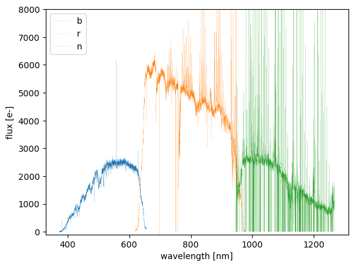

# Analyze Visit-level Data

Now that we have our processed data, let's start exploring the output files! In this section, we'll focus on analyzing visit-level data, working with individual exposures from a single visit. This will give us a more detailed look at the spectra before moving on to coadds, which combine data from multiple visits for improved signal-to-noise and calibration.

## Check Fiber Distribution

---

Before we dive into analyzing the data, the first step is to import the necessary modules. These modules provide essential functions for interacting with the pipeline outputs.
The `butler` interface, a key component of the LSST Science Pipelines, provides a structured and efficient way to access processed data. It manages datasets through a hierarchical system, allowing you to query and retrieve data in an organized manner. Unless you have specific needs that require direct file access, using `butler` is highly recommended for consistency and ease of use.

!!! note
    As discussed in [PFS Datamodel Section](00_01_pfs_datamodel.md), each pipeline output file is defined in [`datamodel`](https://github.com/Subaru-PFS/datamodel/tree/master). If you have a desperate reason not to use the `butler`, then the Python module from the datamodel repository can be used. The module allows you to read/write the pipeline files and is written deliberately to be independent of the LSST stack.

To use the `butler`, you will need to set up PFS pipeline environment before launching the Python:

```
$ source $WORKDIR/(username)/packages/stack_28/loadLSST.bash
$ setup pfs_pipe2d
```

Then in your Python environment (e.g., a Jupyter notebook), you can import the necessary modules:

```
from lsst.daf.butler import Butler
from pfs.datamodel import TargetType
```

We will need to first initialize the `butler`:

```
$DATASTORE = "$WORKDIR/pfs/data/datastore"
$COLLECTION = 'u/(username)/20250218'
butler = Butler.from_config($DATASTORE, collection=[$COLLECTION])
```

Let's assume we want to inspect a `visit=98336`:

```
visit=98336
pfsConfig = butler.get('pfsConfig', visit=visit)
for tt in (TargetType.SCIENCE, TargetType.SKY, TargetType.FLUXSTD):
    select = (pfsConfig.targetType == tt)
    plt.plot(pfsConfig.ra[select], pfsConfig.dec[select], 
             '.', label=tt.name)
plt.legend()
plt.xlabel('R.A. [deg]')
plt.ylabel('Dec. [deg]')
```

Running the code above will generate a figure that visualizes the sky distribution of fibers for a given visit. Each data point represents a fiber assigned to a specific target, the flux standards, or the sky. This allows you to quickly inspect the spatial arrangement of targets and verify the fiber allocation for the sky fiber or flux standard sampling.


## Check `pfsArm` data

---

Now that we've visualized the fiber distribution, let's take a closer look at the spectrum of a specific target. The `pfsArm` files contain the extracted 1D spectra for each spectrograph arm (`b`, `r`, `n`, `m`).

For example, if you want to inspect `pfsArm` with a particular `fiberId`:

```
# fiberID
fiberId = 1163

# for pfsArm, we need to know which spectrograph the object is observed with. We get the spectrograph ID with a utility function.
from pfs.utils.fibers import spectrographFromFiberId
# Spectrograph; here, it is 2.
spectrograph = spectrographFromFiberId(fiberId)

dataId = dict(visit=visit, spectrograph=spectrograph)
for arm in ('b','r','n'):
    pfsArm = butler.get('pfsArm', dataId, arm=arm)
    pfsArm = pfsArm.select(fiberId=fiberId)
    assert len(pfsArm) == 1
    plt.plot(pfsArm.wavelength[0], pfsArm.flux[0], '-', label=arm, linewidth=0.1)
# Skipped unrelated parts #
plt.show()
```

!!! note
    The `dataId` for retriving `pfsArm` is `dataId`=dict(`visit`, `arm`, `spectrograph`) 

You will have the figure showing spectra from the three arms (`b`, `r`, and `n`) without wavelength calibration in one figure:



## Check `pfsMerged` data

---

If you want to inspect `pfsMerged`:

```
pfsMerged = butler.get('pfsMerged', visit=visit).select(fiberId=fiberId)

bad = (pfsMerged.mask[0] & pfsMerged.flags.get('BAD', 'CR', 'SAT')) != 0
good = ~bad

plt.plot(pfsMerged.wavelength[0][good], pfsMerged.flux[0][good], '-', linewidth=0.2, label='flux')
plt.plot(pfsMerged.wavelength[0][good], np.sqrt(pfsMerged.variance[0][good]), '-', linewidth=0.2, label='noise')
plt.plot(pfsMerged.wavelength[0][bad], pfsMerged.flux[0][bad], '.', color='red', label='bad pixels')
# Skipped unrelated parts #
plt.show()
```

!!! note
    The `dataId` for retriving `pfsMerged` is `dataId`=dict(`visit`, `spectrograph`) 

The resulting figure will display the spectrum after merging data from the three arms (`b`, `r`, and `n`). At this stage, wavelength calibration has been applied, but flux calibration has not yet been performed. This step provides a crucial intermediate product, allowing you to check for artifacts, discontinuities between arms, and the overall quality of spectral extraction before applying flux corrections.


## Check `pfsCalibrated` data

Now, let's assume we want to retrieve spectra for specific objects, given their `objId` values in a list:

```
catId = 12345  # Catalogue ID
objId_list = [123, 456]     # List of target object IDs
pfsCalibrated = butler.get('pfsCalibrated', visit=visit)

for objId in objId_list:
    spectrum = pfsCalibrated[catId, objId]
    bad = (spectrum.mask & pfsSingle.flags.get('BAD', 'CR', 'SAT')) != 0
    good = ~bad
    plt.plot(spectrum.wavelength[good], spectrum.flux[good], '-', linewidth=0.2, label='flux')
    plt.plot(spectrum.wavelength[good], np.sqrt(spectrum.variance[good]), '-', linewidth=0.2, label='noise')
    plt.plot(spectrum.wavelength, spectrum.sky, '-', linewidth=0.2, label='sky')
    plt.plot(spectrum.wavelength[bad], spectrum.flux[bad], '.', color='red', label='bad pixels')
plt.show()
```
