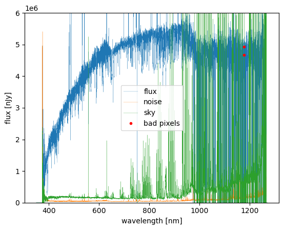

# Analyze Coadded-level Data

For most scientific analyses, users are typically more interested in coadded spectra, which combine multiple exposures to improve signal-to-noise and minimize observational systematics. Instead of working with single-visit spectra, astronomers often use coadded spectra for tasks such as redshift determination, spectral classification, and emission-line measurements.

In this section, we will retrieve coadded data, exploring both `pfsObject` (from the conventional PFS datamodel) and `pfsCoadd` (the recommended format in Gen3). While `pfsObject` was commonly used in earlier pipeline versions, Gen3 introduces `pfsCoadd` as a more efficient way to handle coadded spectra, bundling multiple spectra into a single file.

Since the initialization of the `butler` interface follows the same steps as in the previous section, we will skip that setup here and jump straight into data retrieval.

## Check `pfsObject` Data from Fiber Index

---

To start, let's assume we are interested in a particular target with catalog ID `catId = 4` and a specific fiber index.

```
import glob

catId = 4
path = '%s/pfsObject/%05d/*/*/pfsObject*%016x*fits' % (rerun, catId, pfsConfig.objId[index])
file = glob.glob(path)
pfsObject = datamodel.PfsObject.readFits(file[0])

bad = pfsObject.mask & pfsObject.flags.get('BAD', 'CR', 'SAT') != 0
good = ~bad

plt.plot(pfsObject.wavelength[good], pfsObject.flux[good], '-', linewidth=0.2, label='flux')
plt.plot(pfsObject.wavelength[good], np.sqrt(pfsObject.variance[good]), '-', linewidth=0.2, label='noise')
plt.plot(pfsObject.wavelength, pfsObject.sky, '-', linewidth=0.2, label='sky')
plt.plot(pfsObject.wavelength[bad], pfsObject.flux[bad], '.', color='red', label='bad pixels')

# Skipped unrelated parts #
plt.show()
``` 


  
Since `pfsObject` contains coadded spectra for a single object, this provides a higher S/N spectrum of the target compared to single-visit spectra, reducing noise and improving spectral features.

## Check `pfsCoadd` Data from Object ID

---

With the Gen3 pipeline, the recommended approach for retrieving coadded spectra is using `pfsCoadd`. Unlike `pfsObject`, which stores one spectrum per file, `pfsCoadd` bundles multiple spectra into a single file, improving efficiency.

This file is currently grouped by `catId` (as of 2025/03), meaning all objects from the same catalog will be stored together. However, this structure may evolve in future pipeline updates.

Now, let's assume we want to retrieve spectra for specific objects, given their `objId` values in a list:

```
ObjId_list = [123, 456]     # List of target object IDs
pfsCoadd = butler.get('pfsCoadd', cat_id=catId, combination=rerun)

for _, target in enumerate(pfsCoadd): 
    if target.objId not in ObjId_list:         
        continue     
    pfsObject = butler.get("pfsCoadd.single", combination=rerun, cat_id=catId, parameters=dict(obj_id=target.objId))
```

This will retrieve spectra for only the objects we are interested in, instead of reading the entire dataset.

!!! note
    Reading `pfsCoadd.single` in a loop is inefficient, and one may use indexing or a lookup like `pfsObjectByObjId = {target.objId: pfsCoadd[target] for target in pfsCoadd}` to accelerate the process. We will update the information once the datamodel design gets more stable.