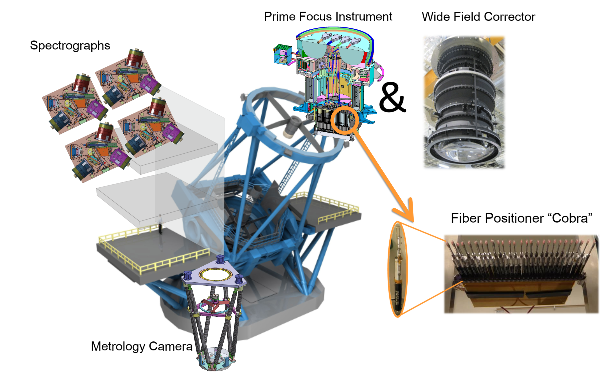
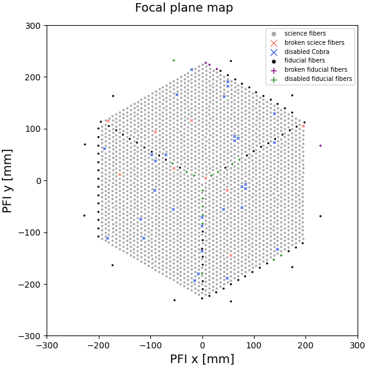
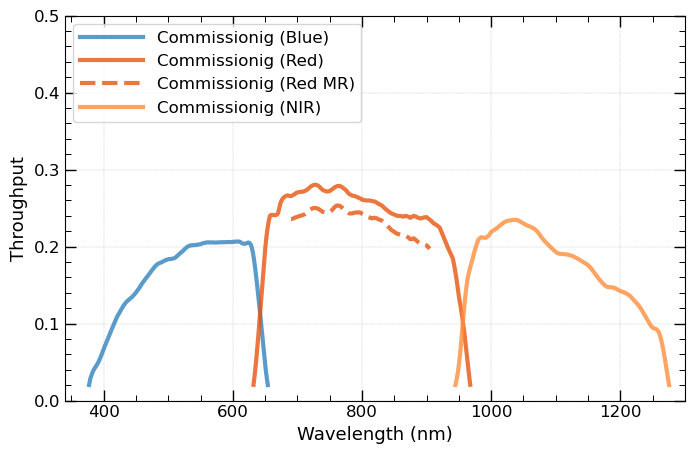

# PFS Introduction

This webpage is mainly for introducing the information of Subaru Prime Focus Spectrograph (PFS) data reduction and data inspection.
Regarding the Subaru PFS instrument, one can check more information from the [PFS intrument page](https://www.naoj.org/Observing/Instruments/PFS/instrument/). 
Here, we selected the necessary information that you may need for understanding the PFS pipeline.

## Overview

---

The PFS instrument consists of several components. See also [here](https://pfs.ipmu.jp/instrumentation.html).

### Wide Field Corrector (WFC)

The WFC is an optical system consisting of 7 lenses designed to correct imaging aberrations for Hyper Suprime-Cam (HSC) and PFS. The largest lens has an effective area of 820 mm (32 inch) in diameter, and the total lens system is 1845 mm (73 inch) long.

### Prime Focus Instrument (PFI)

Together with the WFC, the Prime Focus Instrument (PFI) is installed on the prime focus of the Subaru telescope.

At the focal plane, approximately 2400 fibers are arranged across the ~1.25 deg² hexagonal-shaped field of view. There are two types of fibers: 2394 science fibers and 96 fiducial fibers. Each science fiber is attached to a small actuator, the fiber positioner (see below), and moved to the location of the targets on the focal plane. The fiducial fibers are fixed in their position and used as position references when the science fibers are moved. The fibers are equipped with a microlens on their surface to make the F-ratio slower (F/2.8) and reduce degradation of image quality after passing through the long fiber cable.

A ~54 mm-thick glass plate, the so-called field element, is installed in front of the fibers to achieve the same image quality as HSC. The field element has opaque dots to hide the fibers behind them and block light from reaching the fibers. By doing so, more sparse spectra can be taken by the spectrograph, which enables better understanding of the spectra on the detectors.

Surrounding the hexagonal-shaped field of view, six imaging cameras are accommodated for sky-field acquisition and auto-guiding. Six calibration lamps (one quartz lamp for continuum and five arc lamps: Kr, Ar, Ne, Xe, and HgCd) are installed on the top of PFI to uniformly illuminate the screen on the dome ceiling.

**Fiber Positioner ("Cobra")**

Each science fiber tip is controllable in-plane by the fiber positioner, nicknamed "Cobra," which is a piezo actuator with two rotational axes. The fibers are arranged in a hexagonal pattern with 8 mm separation, with each fiber being able to cover a region of 9.5 mm in diameter. The overlap between adjacent regions enables 100% sky coverage within the hexagonal field.

**Focal Plane Map**

Fiber distribution on the PFI focal plane highlighting the broken/disabled fibers. See the legend for details.

### Spectrograph System (SpS)

The four identical spectrograph modules provide the simultaneous measurement of ~2400 spectra. Each spectrograph module has three independent channels (blue, red, and near-infrared) separated by two dichroic mirrors so that the whole system can cover a wide wavelength range from 0.38 μm to 1.26 μm in one exposure. 
More related parameters are summarized in the table below:

| Parameter           | Specification                    |
|---------------------|----------------------------------|
| Number of Modules   | 4                                |
| Channels per Module | 3 (Blue, Red, Near-Infrared)     |
| Wavelength Coverage | 0.38 μm to 1.26 μm               |
| Resolution          | Low: ∼2300–4300                  |
|                     | Medium (Red Channel): ∼5000      |
| Grating Type        | Volume Phase Holographic (VPH)   |
| Operating Temperature | 5 ± 1 °C                       |

The three channels are also called `arms` in the pipeline, and in the Red-arm, there are two chices of the resolutions (**Low** and **Medium**). 
You can find the parameters listed below:

| Parameter               | Blue           | Red (Low Res.) | Red (Med Res.) | NIR            |
|-------------------------|----------------|----------------|----------------|----------------|
| Spectral Coverage (nm)  | 380 – 650      | 630 – 970      | 710 – 885      | 940 – 1260     |
| Dispersion (Å/pix)      | ∼0.7           | ∼0.9           | ∼0.4           | ∼0.8           |
| Spectral Resolution (Å) | ∼2.1           | ∼2.7           | ∼1.6           | ∼2.4           |
| Resolving Power (R)     | ∼2500 (@500nm) | ∼3000 (@800nm) | ∼5500 (@800nm) | ∼4500 (@1100nm)|
| Throughput (%)          | ∼49% (@500nm)  | ∼52% (@800nm)  | ∼48% (@800nm)  | ∼39% (@1100nm) |

The total throughputs of these channels:

### Fiber System

The fiber system consists of ~2400 optical fibers which relay light collected at the focal plane to the four spectrographs located in the clean room. A fiber cable consists of three parts, to develop and operate the instrument easily. The first part is accommodated within PFI as fiber modules with their "Cobra" positioners, one part is integrated to SpS as fiber slit assembly, and the third part is developed as a long fiber cable routed on the telescope and in the dome building. The total length of each fiber is 65 meters, assembled into four groups providing 600 inputs to each spectrograph. In addition to the ~2400 science fibers, the monitoring fibers are accommodated to check connection at installation.

### Metrology Camera System (MCS)

The MCS is attached to the Cassegrain Focus of the Subaru telescope and measures the positions of the fibers on the prime focus. MCS can take an image of all ~2400 fibers in a single exposure using a large format (8960 pixels x 5778 pixels) CMOS camera. The primary mirror of MCS is 380 mm in diameter to average out the local surface error of WFC.

## Data FITS Header

---

### PFS FITS Header Keywords

Examples of the FITS header for PFS data are accessible from the list below.

| Since           | PFSA           | PFSB           | PFSC           |
|-----------------|----------------|----------------|----------------|
| 2024.05         | [HeaderSample_PFSA.txt](https://www.naoj.org/Observing/Instruments/PFS/fits/HeaderSample_PFSA.txt)  | [HeaderSample_PFSB.txt](https://www.naoj.org/Observing/Instruments/PFS/fits/HeaderSample_PFSB.txt)  | [HeaderSample_PFSC.txt](https://www.naoj.org/Observing/Instruments/PFS/fits/HeaderSample_PFSC.txt)  | 

### PFS instrument FITS cards

[Latest (ics_actorkeys 1.6.22 etc.)](https://www.naoj.org/Observing/Instruments/PFS/fits/PFSInstrumentCard/)

## Publications

---

- Naoyuki Tamura et al., ["Prime Focus Spectrograph (PFS) for Subaru Telescope: progressing final steps to science operation", SPIE 13096, 1309605 (2024)](https://ui.adsabs.harvard.edu/abs/2024SPIE13096E..05T/abstract)
- Naoyuki Tamura et al., ["Prime Focus Spectrograph (PFS) for the Subaru Telescope: its start of the last development phase", SPIE 12184, 1218410 (2022)](https://ui.adsabs.harvard.edu/abs/2022SPIE12184E..10T/abstract)
- Shiang-Yu Wang et al., ["Prime focus spectrograph (PFS) for the Subaru Telescope: the prime focus instrument", SPIE 12184, 121846R (2022)](https://ui.adsabs.harvard.edu/abs/2022SPIE12184E..6RW/abstract)
- Stephen A. Smee et al., ["Performance of the near-infrared camera for the Subaru Prime Focus Spectrograph", SPIE 12184, 121847L (2022)](https://ui.adsabs.harvard.edu/abs/2022SPIE12184E..7LS/abstract)
- Antonio Cesar de Oliveira et al., ["Prime Focus Spectrograph (PFS): fiber optical cable and connector system (FOCCoS) - integration", SPIE 12184, 1218474 (2022)](https://ui.adsabs.harvard.edu/abs/2022SPIE12184E..74D/abstract)
- Neven Capler et al., ["Prime focus spectrograph (PFS) for the Subaru Telescope: 2D modeling of the point spread function", SPIE 12184, 1218470 (2022)](https://ui.adsabs.harvard.edu/abs/2022SPIE12184E..70C/abstract) 
- Shiang-Yu Wang, ["Prime Focus Spectrograph (PFS): the metrology camera system", SPIE 11447 (2020)](https://ui.adsabs.harvard.edu/abs/2020SPIE11447E..84W/abstract)
- Alain Schmitt, [AMAZED: Algorithm for Massive Automated Z Evaluation and Determination](https://ui.adsabs.harvard.edu/abs/2019ASPC..521..398S/abstract)
- Hajime Sugai, ["Prime Focus Spectrograph for the Subaru telescope: massively multiplexed optical and near-infrared fiber spectrograph", JATIS 1(3) 035001 (2015)](https://ui.adsabs.harvard.edu/abs/2015JATIS...1c5001S/abstract)

For more publications, please see [here](https://pfs.ipmu.jp/research/publication.html).